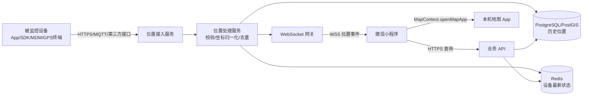

# 移动设备监控微信小程序 MVP 设计方案

> 文档版本：v1.0  
> 编写日期：2026-07-27  
> 目标阶段：MVP（最小可行产品）

## 1. 项目概述

本项目面向已授权的设备管理员或设备所有者，提供一个微信小程序，用于：

1. 查看已绑定设备的最新位置和在线状态；
2. 查看指定时间段内的历史移动轨迹；
3. 将设备当前位置作为目的地，通过微信小程序 `MapContext.openMapApp` 拉起手机中可用的地图 App 进行导航。

### 1.1 必须先确认的前置条件

微信小程序不能直接或静默读取“另一台设备”的位置。被监控设备必须已经具备独立的位置上报能力，例如：

- 设备端 App/SDK 定时上报；
- 企业 MDM/EMM 平台提供位置接口；
- GPS/物联网终端通过 MQTT 或 HTTPS 上报；
- 已有第三方设备平台通过 Webhook 或开放 API 提供位置。

因此，完整链路是“被监控设备上报位置 → 业务服务端存储与分发 → 小程序查询和展示”。如果当前尚无设备侧上报能力，应把设备端定位与上报能力作为独立项目先行验证。

### 1.2 MVP 的验证目标

- 验证用户是否能快速找到指定设备；
- 验证位置数据能否以可接受的时延展示；
- 验证历史轨迹对找车、找设备、外勤管理等场景是否有价值；
- 验证从设备位置到第三方地图导航的流程是否顺畅；
- 验证设备授权、位置隐私与审计机制是否满足上线要求。

## 2. 用户与核心场景

### 2.1 MVP 用户角色

| 角色 | 权限 |
| --- | --- |
| 设备管理员 | 查看其组织内已授权设备的位置、轨迹和状态，发起导航 |
| 设备所有者 | 查看本人名下已绑定设备的位置、轨迹和状态，发起导航 |

MVP 不开放匿名查询，也不支持用户仅凭设备编号搜索或绑定设备。用户与设备的关系由后台预先配置，或通过有时效、可核销的绑定凭证建立。

### 2.2 核心用户故事

- 作为管理员，我可以看到自己有权限查看的设备列表及其在线状态；
- 作为管理员，我可以进入设备详情，在地图上看到设备最新位置和最后上报时间；
- 作为管理员，我可以选择时间范围，查看设备的历史移动轨迹；
- 作为管理员，我可以点击“导航到设备”，选择本机地图 App 并开始导航；
- 当设备离线、位置过期或没有轨迹时，我可以看到明确的原因，而不是误把旧位置当成实时位置。

## 3. MVP 范围

### 3.1 本期必须实现（P0）

| 模块 | 能力 |
| --- | --- |
| 登录与授权 | 微信登录、服务端会话、用户与设备权限校验 |
| 设备列表 | 设备名称、编号、在线状态、最后上报时间、最新位置摘要 |
| 实时位置 | 单设备地图、最新定位点、精度圈（数据支持时）、更新时间、速度、电量（数据支持时） |
| 状态更新 | WebSocket 推送最新点；断线后自动重连；失败时降级为轮询 |
| 历史轨迹 | 查询今天/昨天/自定义时间段，地图折线、起点、终点、关键点和轨迹摘要 |
| 地图导航 | 使用 `MapContext.openMapApp` 拉起地图 App，低版本或失败时降级到 `wx.openLocation` |
| 异常状态 | 无定位、定位过期、设备离线、无轨迹、网络异常、无权限 |
| 安全审计 | 设备级访问控制、位置查询审计、敏感数据保护和基础限流 |

### 3.2 暂不纳入 MVP（P1/P2）

- 电子围栏和进出围栏告警；
- 轨迹动画回放、暂停和倍速；
- 轨迹道路纠偏或“吸附道路”；
- 多设备在同一地图上的持续实时监控；
- 设备远程控制、响铃、锁定或下发指令；
- 位置共享链接、多人协同处置；
- 复杂组织架构、审批流和精细化报表；
- 离线地图、全球地图服务自动切换。

## 4. 信息架构与页面设计

MVP 使用 3 个主页面，避免过早增加 Tab 和管理页面。

```text
微信登录/会话恢复
        │
        ▼
设备列表 ───────────────┐
        │               │
        ▼               │
实时位置页 ── 导航到设备 │
        │               │
        ▼               │
历史轨迹页 ◄─────────────┘
```

### 4.1 设备列表页

每个设备卡片展示：

- 设备名称与设备编号后四位；
- 在线、位置过期或离线状态；
- 最后上报时间，例如“12 秒前”；
- 位置文字摘要；没有逆地理编码结果时显示经纬度；
- 电量（设备有该字段时）；
- 点击卡片进入实时位置页。

交互要求：

- 支持按设备名称或编号搜索；
- 下拉刷新；
- 首屏骨架屏；
- 无设备时显示“请联系管理员绑定设备”，不提供无授权绑定入口。

### 4.2 实时位置页

页面结构：

1. 顶部状态栏：设备名称、在线状态、最后上报时间；
2. 中部地图：设备 Marker、精度圈或方向信息；
3. 底部信息卡：位置描述、经纬度、速度、电量；
4. 主操作：“导航到设备”；
5. 次操作：“查看轨迹”“回到设备位置”“刷新”。

状态定义建议：

| 状态 | 默认判定规则 | 页面提示 |
| --- | --- | --- |
| 在线 | 最后上报时间不超过 60 秒 | 绿色，“刚刚更新” |
| 位置过期 | 超过 60 秒且不超过 5 分钟 | 橙色，明确展示更新时间 |
| 离线 | 超过 5 分钟 | 灰色，“设备已离线，以下为最后位置” |
| 从未定位 | 无有效定位点 | 不显示 Marker，提示检查设备定位与网络 |

阈值必须由服务端配置，并根据设备实际上报周期调整。页面不要用“实时位置”掩盖旧数据。

### 4.3 历史轨迹页

页面结构：

- 时间筛选：今天、昨天、自定义；
- 地图：轨迹折线、起点、终点；
- 摘要：时间范围、总里程、点数、最后位置；
- 点击轨迹关键点可查看该点时间、速度和定位精度；
- 无数据时区分“设备未上报”和“筛选范围内无轨迹”。

MVP 自定义时间范围最多查询 24 小时，默认最多向小程序返回 2,000 个绘制点。服务端保留原始点，按地图缩放级别或误差阈值抽稀后再返回，避免小程序地图卡顿。

## 5. 总体技术架构



### 5.1 推荐技术选型

| 层级 | MVP 推荐 | 原因 |
| --- | --- | --- |
| 小程序 | UniApp + wot-ui + TypeScript + UnoCSS | 地图组件和 `MapContext` 适配链路最短 |
| 服务端 | Node.js + NestJS，或团队已有成熟框架 | REST/WebSocket 开发快；优先服从团队现有技术栈 |
| 数据库 | PostgreSQL + PostGIS | 适合轨迹范围查询和后续地理围栏扩展 |
| 缓存 | Redis | 保存最新位置、在线状态、短会话及推送路由 |
| 实时通道 | WSS WebSocket | 服务端有新位置时主动推送，降低无效请求 |
| 设备接入 | HTTPS；高频或大规模设备使用 MQTT | MVP 可先适配已有设备平台，不强制自建设备协议 |

如果已有 IoT/MDM 平台，应优先复用其鉴权、设备注册和位置接入能力。MVP 不应同时自建设备固件、MQTT 平台和完整监控后台。

### 5.2 实时更新策略

1. 进入实时位置页时，先通过 REST 获取设备最新快照，保证首屏可用；
2. 页面建立 WSS 连接并订阅当前设备；
3. 服务端收到新的合法定位点后，推送 `location.updated` 事件；
4. 小程序更新 Marker 和状态卡，不在每个点到达时强制重置地图缩放；
5. WebSocket 断开后采用指数退避重连；重连期间每 15 秒轮询一次最新位置；
6. 小程序进入后台时停止高频 UI 更新，回到前台后重新拉取快照并恢复连接。

建议设备移动时每 10～30 秒上报一次、静止时降低频率。真正的端到端时延由设备采样周期、设备网络和服务端推送共同决定。

## 6. 位置数据与坐标系

### 6.1 核心原则

设备来源必须明确声明坐标系，禁止只传经纬度而不说明 `coordinateSystem`。国内设备常见 WGS-84、GCJ-02 或第三方地图坐标，混用会造成 Marker、轨迹和导航目的地偏移。

推荐处理方式：

- 原始位置按原值保存，并记录来源与原始坐标系；
- 服务端统一生成供微信地图展示和导航使用的 `mapLatitude`、`mapLongitude`；
- 转换逻辑集中在服务端，不在各个小程序页面重复实现；
- 接口返回的坐标字段明确标注坐标系版本；
- 上线前使用真实设备在目标运营区域做地图对点测试。

### 6.2 定位点校验

接入服务至少执行以下校验：

- 经度在 `[-180, 180]`、纬度在 `[-90, 90]`；
- 设备、时间戳和坐标系必填；
- 拒绝明显超前或过旧的异常时间戳；
- 以 `deviceId + recordedAt + sequence` 做幂等去重；
- 标记而不是直接删除低精度点，轨迹查询时再按规则过滤；
- 对不可能的瞬时速度跳点进行异常标记；
- 原始点与清洗结果可追溯。

## 7. 数据模型

### 7.1 Device

| 字段 | 类型 | 说明 |
| --- | --- | --- |
| `id` | UUID/string | 内部设备 ID |
| `externalId` | string | 设备平台 ID，唯一 |
| `name` | string | 展示名称 |
| `status` | enum | active/disabled |
| `lastSeenAt` | datetime | 最后通信时间 |
| `createdAt` | datetime | 创建时间 |

### 7.2 LocationPoint

| 字段 | 类型 | 说明 |
| --- | --- | --- |
| `id` | bigint/UUID | 定位点 ID |
| `deviceId` | string | 设备 ID，建立组合索引 |
| `recordedAt` | datetime | 设备采集时间，统一保存为 UTC |
| `receivedAt` | datetime | 服务端接收时间 |
| `rawLatitude/rawLongitude` | decimal | 原始坐标 |
| `rawCoordinateSystem` | enum | wgs84/gcj02/其他来源 |
| `mapLatitude/mapLongitude` | decimal | 小程序地图使用坐标 |
| `accuracy` | number/null | 精度，米 |
| `speed` | number/null | 速度，m/s |
| `heading` | number/null | 方向，0～359° |
| `battery` | number/null | 电量百分比 |
| `qualityFlags` | json/bitset | 低精度、跳点、时间异常等标记 |

核心索引：`(device_id, recorded_at DESC)`。数据量增加后按月或按日分区。

### 7.3 UserDeviceBinding

| 字段 | 类型 | 说明 |
| --- | --- | --- |
| `userId` | string | 业务用户 ID |
| `deviceId` | string | 设备 ID |
| `role` | enum | owner/admin/viewer |
| `validFrom/validTo` | datetime | 授权有效期 |
| `revokedAt` | datetime/null | 撤销时间 |

所有设备位置和轨迹查询都必须通过此绑定关系校验，不能仅依赖前端隐藏设备 ID。

## 8. API 设计

所有业务接口使用 HTTPS，统一响应中包含 `requestId`。时间使用 ISO 8601 UTC，页面按用户时区展示。

### 8.1 登录

`POST /api/v1/auth/wechat-login`

```json
{
  "code": "wx.login 返回的临时 code"
}
```

服务端换取微信身份后返回短期访问令牌和用户信息。不要把 `openid` 当作接口请求中的可信身份参数。

### 8.2 设备列表

`GET /api/v1/devices?keyword=&cursor=&limit=20`

返回设备基本信息及最新状态摘要。列表接口不返回完整历史位置。

### 8.3 最新位置

`GET /api/v1/devices/{deviceId}/location/latest`

```json
{
  "deviceId": "dev_001",
  "status": "online",
  "location": {
    "latitude": 31.2304,
    "longitude": 121.4737,
    "coordinateSystem": "gcj02",
    "recordedAt": "2026-07-27T08:00:00Z",
    "receivedAt": "2026-07-27T08:00:01Z",
    "accuracy": 12,
    "speed": 3.2,
    "heading": 80,
    "battery": 76
  }
}
```

### 8.4 历史轨迹

`GET /api/v1/devices/{deviceId}/track?startAt=&endAt=&maxPoints=2000`

返回：

- 实际查询时间范围；
- 原始有效点数量和返回绘制点数量；
- 轨迹点数组；
- 起点、终点、里程和数据质量提示。

里程按相邻有效原始点计算，抽稀只影响绘制，不影响统计。MVP 不做道路里程纠偏，应在 UI 标注“估算里程”。

### 8.5 WebSocket

连接：`wss://api.example.com/ws/v1?token=<short-lived-token>`

订阅消息：

```json
{
  "type": "device.subscribe",
  "requestId": "req_001",
  "deviceId": "dev_001"
}
```

位置事件：

```json
{
  "type": "location.updated",
  "eventId": "evt_001",
  "deviceId": "dev_001",
  "location": {
    "latitude": 31.2304,
    "longitude": 121.4737,
    "coordinateSystem": "gcj02",
    "recordedAt": "2026-07-27T08:00:00Z"
  }
}
```

服务端必须在订阅时再次校验用户与设备的授权关系。客户端根据 `eventId` 去重，并忽略时间早于当前快照的乱序事件。

## 9. `openMapApp` 导航设计

### 9.1 接口约束

这里使用的是地图上下文方法 `MapContext.openMapApp`，不是全局的 `wx.openMapApp`：

- 微信基础库 2.14.0 起支持；
- 功能是拉起地图 App 选择导航；
- 必填参数为 `longitude`、`latitude` 和 `destination`；
- 可通过 `preferApplication` 推荐百度、谷歌、高德、腾讯、花瓣或苹果地图；
- 官方文档明确该方法不支持 Promise 风格，应使用 `success`、`fail`、`complete` 回调；
- 调用前页面中必须已有对应的 `<map>` 组件，并通过 `wx.createMapContext` 创建上下文。

建议默认不指定 `preferApplication`，让系统和用户选择已安装的地图；只有在明确的业务要求下才推荐某个地图 App。

### 9.2 页面示例

```xml
<map
  id="deviceMap"
  longitude="{{deviceLocation.longitude}}"
  latitude="{{deviceLocation.latitude}}"
  markers="{{markers}}"
/>

<button bindtap="navigateToDevice">导航到设备</button>
```

```ts
Page({
  navigateToDevice() {
    const location = this.data.deviceLocation

    if (!location || !Number.isFinite(location.latitude) || !Number.isFinite(location.longitude)) {
      wx.showToast({ title: '暂无有效设备位置', icon: 'none' })
      return
    }

    const fallback = () => {
      wx.openLocation({
        latitude: location.latitude,
        longitude: location.longitude,
        name: this.data.device.name,
        address: this.data.locationAddress || '设备最后位置',
        scale: 16
      })
    }

    const mapContext = wx.createMapContext('deviceMap', this)

    if (typeof mapContext.openMapApp !== 'function') {
      fallback()
      return
    }

    mapContext.openMapApp({
      latitude: location.latitude,
      longitude: location.longitude,
      destination: this.data.device.name,
      fail: fallback
    })
  }
})
```

生产代码还应防止连续点击，并上报“点击导航、拉起成功、拉起失败、降级打开”等匿名事件。不要在分析日志中写入完整经纬度。

### 9.3 导航交互规则

- 仅能在用户主动点击按钮后发起；
- 位置超过 5 分钟未更新时，先弹窗说明“将导航到最后上报位置”并显示具体时间；
- 无合法定位点时禁用按钮；
- 导航目的地使用按钮点击时的定位快照，避免弹窗期间数据变化造成文案与坐标不一致；
- 外部地图负责获取当前手机位置和规划路线，小程序只传入设备目的地；
- 开发者工具不能替代真机拉起测试，必须覆盖 iOS、Android 和目标微信版本。

## 10. 安全、隐私与合规

位置轨迹属于高敏感数据，MVP 上线不能只做前端页面授权。

### 10.1 必做措施

- 被监控设备的所有者或合法管理方必须知情并授权位置采集；
- 在小程序隐私保护指引中准确说明收集目的、使用方式、保存期限和第三方处理情况；
- 只为当前功能申请必要能力。若不展示操作手机自身的位置，不应额外申请用户当前位置权限；
- 服务端对每一次最新位置、轨迹查询和 WebSocket 订阅执行设备级鉴权；
- 全链路 HTTPS/WSS，令牌短期有效并支持撤销；
- 数据库、备份和运维访问按最小权限控制；
- 记录谁在何时查看了哪台设备，但普通应用日志不记录完整经纬度和访问令牌；
- 默认保留轨迹 30 天，期满删除或匿名化；具体期限由业务和合规要求确认；
- 提供解除绑定、撤销授权和数据删除的后台流程；
- 接口按用户、设备和 IP 限流，防止批量遍历与轨迹抓取。

### 10.2 上线前合规检查

- 确认业务是否涉及员工、儿童、车辆、租赁设备等特殊场景；
- 完成被监控端的明示告知与同意留痕；
- 核对小程序后台的隐私接口声明及用户隐私保护指引；
- 核对地图、逆地理编码、云服务等供应商的数据处理条款；
- 由业务所在地的合规或法务人员复核，不以本技术方案替代法律意见。

## 11. 非功能指标

以下是 MVP 建议基线，需在立项时结合设备数量调整：

| 指标 | MVP 目标 |
| --- | --- |
| 规划容量 | 100 台注册设备、50 台活跃设备、100 名并发查看用户 |
| 设备上报频率 | 移动时 10～30 秒；静止时降低频率 |
| 实时展示时延 | 服务端收到位置后至前端更新 P95 ≤ 2 秒 |
| 端到端位置新鲜度 | 正常网络下 P95 ≤ 15 秒，受设备采样周期影响 |
| 最新位置接口 | P95 ≤ 500 ms |
| 24 小时轨迹查询 | P95 ≤ 3 秒，返回不超过 2,000 个绘制点 |
| 可用性 | 核心查询接口月可用性 ≥ 99.5% |
| 数据保留 | 默认 30 天，可配置 |

## 12. 异常与降级策略

| 场景 | 处理方式 |
| --- | --- |
| WebSocket 断开 | 指数退避重连；期间每 15 秒轮询 |
| 接口超时 | 保留最后一次成功快照，明确标记数据时间，不伪装为实时 |
| 定位点异常 | 服务端标记并排除出默认轨迹；原始点保留以便排查 |
| 逆地理编码失败 | 直接显示格式化经纬度，不影响地图和导航 |
| `openMapApp` 不支持或失败 | 降级调用 `wx.openLocation` |
| 设备无权限 | 返回 404 或统一资源不可见响应，避免泄露设备是否存在 |
| 轨迹点过多 | 服务端抽稀，并在响应中返回抽稀前后点数 |
| 用户反复点击导航 | 点击后短时禁用，避免连续拉起 |

## 13. 数据埋点与 MVP 成功标准

只记录必要的产品事件，不记录完整位置：

- `device_list_view`：设备列表访问；
- `device_detail_view`：实时位置页访问；
- `track_query`：轨迹查询及是否成功；
- `navigation_click`：点击导航；
- `navigation_open_success/fail/fallback`：地图拉起结果；
- `realtime_ws_connected/disconnected`：实时链路质量。

MVP 试运行 2～4 周后，满足以下条件可进入下一阶段：

- 核心链路“列表 → 实时位置 → 导航”成功率 ≥ 95%；
- 有有效数据的轨迹查询成功率 ≥ 98%；
- 导航按钮到地图打开的成功或降级成功率 ≥ 95%；
- 无越权访问事件；
- 试点用户能独立完成设备定位和导航，不依赖人工指导；
- 位置时延、漂移和轨迹质量满足试点业务的可用标准。

## 14. 开发计划与交付物

以 1 名前端、1 名后端、兼职测试和产品/设计支持估算，MVP 可按 3 周排期；设备接入尚未完成时需另行估算。

### 第 1 周：链路打通

- 明确设备协议、坐标系、上报频率和授权方式；
- 完成微信登录、用户设备绑定、设备列表；
- 建立位置接入、最新位置缓存和历史点存储；
- 用真实设备打通“上报 → 查询”闭环。

### 第 2 周：地图与实时位置

- 完成实时位置页、地图 Marker 和状态判定；
- 完成 WebSocket 推送、重连和轮询降级；
- 完成错误态、加载态和基础埋点；
- 验证不同坐标源的地图落点。

### 第 3 周：轨迹、导航与上线准备

- 完成轨迹查询、抽稀、折线和摘要；
- 完成 `openMapApp`、低版本兼容及真机测试；
- 完成权限、审计、限流和隐私文案；
- 压测、灰度、监控告警和验收。

交付物：

- 可提交审核的小程序版本；
- 位置接入说明与业务 API 文档；
- 数据库迁移脚本和部署说明；
- 隐私与权限清单；
- 测试报告、已知问题和回滚方案；
- 基础运行监控面板。

## 15. 验收用例

### 15.1 功能验收

- 有权限用户只能看到已绑定设备；
- 新位置到达后，详情页 Marker 和更新时间自动刷新；
- WebSocket 断开后能自动重连或进入轮询，页面不崩溃；
- 离线设备明确显示最后位置及其时间；
- 选择今天、昨天或自定义时间后能正确绘制轨迹起终点；
- 轨迹无数据、点数过多、存在异常点时均有正确反馈；
- 点击导航能拉起可用地图 App；接口不可用时可降级；
- 设备位置已过期时，导航前出现风险提示；
- 用户授权撤销后，REST 和 WebSocket 均立即失去设备访问权。

### 15.2 兼容性验收

- 目标范围内的微信基础库版本；
- 至少 2 台 Android、2 台 iPhone 真机；
- 如目标用户涉及鸿蒙微信，增加对应真机；
- 未安装推荐地图、安装多个地图、系统限制拉起等场景；
- 弱网、断网、前后台切换和微信进程重启；
- WGS-84、GCJ-02 等实际设备坐标源的对点验证。

## 16. 立项前待确认问题

以下问题会直接影响工期，应在第 1 周开始前确认：

1. 被监控的是手机、车辆终端还是其他 GPS 设备？
2. 设备侧是否已能稳定上报位置？协议、坐标系和频率是什么？
3. 预计注册设备数、同时在线设备数和轨迹保留期是多少？
4. 用户如何获得设备查看权限，谁可以撤销？
5. 主要运营区域是否仅在中国大陆？
6. 是否已有后端、IoT 平台、账号体系和运维环境可复用？
7. 业务对“实时”的可接受时延和设备功耗要求是什么？
8. 是否必须指定某个地图 App，还是让用户自行选择？

## 17. 官方接口参考

- [`MapContext.openMapApp`](https://developers.weixin.qq.com/miniprogram/dev/api/media/map/MapContext.openMapApp.html)
- [`MapContext`](https://developers.weixin.qq.com/miniprogram/dev/api/media/map/MapContext.html)
- [`map` 组件](https://developers.weixin.qq.com/miniprogram/dev/component/map.html)
- [`wx.openLocation`](https://developers.weixin.qq.com/miniprogram/dev/api/location/wx.openLocation.html)

正式开发和提审前应再次核对微信官方文档、基础库兼容性及隐私接口要求。
